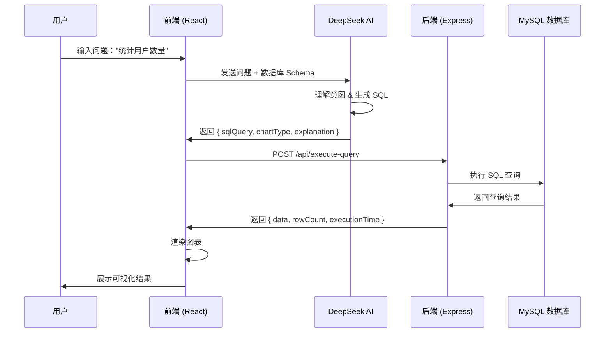

# 🚀 InsightAI - 对话式商业智能分析平台

<div align="center">


**通过自然语言对话，让数据分析变得简单直观**

[功能演示](#-核心功能) · [快速开始](#-快速开始) · [技术架构](#-技术架构) · [API文档](#-api文档)

</div>

---

## 📋 项目简介

InsightAI 是一个创新的商业智能(BI)平台，它将**自然语言处理**与**数据库查询**完美结合。用户只需用中文提问，AI 就能自动生成 SQL 查询、执行查询并以精美的图表展示结果。

### 🎯 解决的问题

- ❌ 传统 BI 工具学习曲线陡峭，需要专业知识
- ❌ 数据分析师需要花大量时间编写重复的 SQL 查询
- ❌ 业务人员难以直接从数据库获取洞察
- ✅ **InsightAI 让所有人都能轻松分析数据！**

---

## ✨ 核心功能

### 🔌 智能数据库连接
- **实时连接** MySQL 数据库
- **自动检测**所有表和字段结构
- **详细的元数据**获取（字段类型、主键、注释等）
- **连接池管理**确保高性能和稳定性

### 💬 自然语言查询
```
用户: "显示最近3个月的销售趋势"
AI: ✓ 理解意图
    ✓ 生成 SQL: SELECT MONTH(date) as month, SUM(amount) as revenue FROM orders...
    ✓ 执行查询
    ✓ 展示折线图
```

**支持的查询类型：**
- 📊 数据统计和聚合
- 📈 趋势分析
- 🔍 筛选和条件查询
- 🔗 多表关联查询（JOIN）
- 📅 时间序列分析

### 📊 智能数据可视化

| 图表类型 | 适用场景 | 示例 |
|---------|---------|------|
| 📊 柱状图 (Bar Chart) | 对比分析、分类统计 | 各城市销售额对比 |
| 📈 折线图 (Line Chart) | 趋势分析、时间序列 | 月度用户增长趋势 |
| 🌊 面积图 (Area Chart) | 累积趋势、占比变化 | 累计营收增长 |
| 🥧 饼图 (Pie Chart) | 比例分布、构成分析 | 产品类别销售占比 |
| 🔵 散点图 (Scatter) | 相关性分析、分布 | 价格与销量关系 |

### 🎨 现代化用户界面
- **暗色主题**设计，减少视觉疲劳
- **响应式布局**，支持桌面和移动设备
- **实时反馈**，显示查询执行状态
- **平滑动画**，提升用户体验
- **代码高亮**，SQL 预览更清晰

### 🔒 安全性保障
- ✅ **SQL 注入防护** - 仅允许 SELECT 查询
- ✅ **连接超时控制** - 防止资源占用
- ✅ **连接池限制** - 避免数据库过载
- ✅ **环境变量保护** - 敏感信息不暴露

---

## 🏆 项目亮点

### 1️⃣ 创新的 AI + BI 融合
将 DeepSeek 大语言模型与传统 BI 结合，实现真正的"对话式数据分析"。

### 2️⃣ 实时数据查询
不是生成模拟数据，而是连接**真实数据库**，执行**真实查询**，展示**实时结果**。

### 3️⃣ 智能图表选择
AI 根据数据类型和查询意图，自动选择最合适的可视化方式。

### 4️⃣ 开发者友好
- 清晰的模块化架构
- 完整的 TypeScript 类型定义
- 详细的代码注释
- RESTful API 设计

### 5️⃣ 生产级代码质量
- 错误处理完善
- 日志记录详细
- 优雅的关闭机制
- 性能优化（连接池、查询超时）

### 6️⃣ 多语言支持
- **AI 回复使用中文**，更符合国内用户习惯
- **SQL 和图表配置保持英文**，遵循国际标准
- 完美平衡本地化与标准化

---

## 🛠 技术架构

### 系统架构图

```
┌─────────────────────────────────────────────────────────────────┐
│                          用户浏览器                              │
│                      (React 19 + TypeScript)                    │
└────────────────────────────┬────────────────────────────────────┘
                             │ HTTP/HTTPS
                             ↓
┌─────────────────────────────────────────────────────────────────┐
│                        前端服务 (Vite)                           │
│  ┌─────────────────┐  ┌─────────────────┐  ┌─────────────────┐ │
│  │  ConnectionModal │  │  ChatInterface  │  │  Visualization  │ │
│  └─────────────────┘  └─────────────────┘  └─────────────────┘ │
└────────────┬──────────────────────────────────────┬─────────────┘
             │                                      │
             │ /api/*                               │ HTTPS
             ↓                                      ↓
┌─────────────────────────┐          ┌─────────────────────────────┐
│  后端 API (Express)      │          │    DeepSeek AI API          │
│  ┌──────────────────┐   │          │  (SQL 生成 & 自然语言理解)   │
│  │  连接管理        │   │          └─────────────────────────────┘
│  │  Schema 检测     │   │
│  │  查询执行        │   │
│  └──────────────────┘   │
└────────────┬─────────────┘
             │ MySQL Protocol
             ↓
┌─────────────────────────┐
│    MySQL 数据库          │
│  (生产数据/测试数据)      │
└─────────────────────────┘
```

### 技术栈详解

#### 前端技术栈
```json
{
  "核心框架": {
    "React": "19.2.0 - 最新版本，性能优化",
    "TypeScript": "5.8.2 - 类型安全",
    "Vite": "6.2.0 - 极速开发体验"
  },
  "UI/UX": {
    "TailwindCSS": "实用优先的 CSS 框架",
    "Heroicons": "精美的 SVG 图标库",
    "Recharts": "3.4.1 - 强大的图表库"
  },
  "状态管理": {
    "React Hooks": "useState, useEffect 等"
  }
}
```

#### 后端技术栈
```json
{
  "运行环境": {
    "Node.js": "18+ - LTS 版本",
    "Express": "4.18.2 - 成熟稳定的 Web 框架"
  },
  "数据库": {
    "MySQL2": "3.6.5 - MySQL 驱动，支持 Promise",
    "连接池": "自动管理连接，提升性能"
  },
  "中间件": {
    "CORS": "跨域资源共享支持",
    "dotenv": "环境变量管理"
  }
}
```

#### AI 服务
```json
{
  "大语言模型": {
    "DeepSeek API": "强大的 SQL 生成能力",
    "模型": "deepseek-chat",
    "温度": "0.3 - 保证输出稳定性",
    "输出格式": "JSON - 结构化数据"
  }
}
```

---

## 🚀 快速开始

### 前置要求
- Node.js 18+ 
- MySQL 5.7+ 或 8.0+
- DeepSeek API Key

### 安装步骤

#### 1. 克隆项目
```bash
git clone https://github.com/yourusername/insightai-conversational-bi.git
cd insightai-conversational-bi
```

#### 2. 一键安装所有依赖
```bash
npm run setup
```

或手动安装：
```bash
# 安装前端依赖
npm install

# 安装后端依赖
cd server
npm install
cd ..
```

#### 3. 配置 DeepSeek API
在 `services/deepseekService.ts` 中配置你的 API Key：
```typescript
const API_KEY = 'sk-your-deepseek-api-key';
```

#### 4. 启动应用

**方式一：同时启动前后端（推荐）**
```bash
npm run dev:all
```

**方式二：分别启动**
```bash
# 终端 1 - 启动后端
cd server
npm start

# 终端 2 - 启动前端
npm run dev
```

#### 5. 访问应用
打开浏览器访问：`http://localhost:3000`

---

## 📖 使用指南

### 步骤 1：连接数据库

点击侧边栏的 "No Connection" 按钮，填写数据库信息：

```
Host: localhost 或 IP 地址
Port: 3306
Database: your_database_name
Username: your_username
Password: your_password
```

### 步骤 2：开始提问

连接成功后，在聊天框中输入问题：

**示例问题：**
```
✅ "显示所有用户"
✅ "统计每个月的订单数量"
✅ "查询销售额前10的商品"
✅ "按城市分组统计用户数量"
✅ "显示最近7天的活跃用户趋势"
✅ "哪些产品的库存低于100？"
```

### 步骤 3：查看结果

AI 会自动：
1. 🤔 理解你的问题
2. 📝 生成 SQL 查询
3. ⚡ 执行查询
4. 📊 选择合适的图表
5. ✨ 展示可视化结果

---

## 🔌 API 文档

### 后端 API 端点

#### 1. 健康检查
```http
GET /api/health
```

**响应示例：**
```json
{
  "status": "ok",
  "timestamp": "2025-11-22T10:30:00.000Z",
  "activeConnections": 2
}
```

#### 2. 测试数据库连接
```http
POST /api/test-connection
Content-Type: application/json

{
  "host": "localhost",
  "user": "root",
  "password": "password",
  "database": "mydb",
  "port": 3306
}
```

**响应示例：**
```json
{
  "success": true,
  "message": "Connection successful"
}
```

#### 3. 连接数据库并获取 Schema
```http
POST /api/connect
Content-Type: application/json

{
  "host": "localhost",
  "user": "root",
  "password": "password",
  "database": "mydb",
  "port": 3306
}
```

**响应示例：**
```json
{
  "success": true,
  "connectionId": "localhost_mydb_1732272000000",
  "message": "Successfully connected to mydb. Found 5 tables.",
  "schema": [
    {
      "name": "users",
      "columns": ["id", "name", "email", "created_at"],
      "columnDetails": [
        {
          "name": "id",
          "type": "int",
          "nullable": false,
          "key": "PRI",
          "comment": "用户ID"
        }
      ]
    }
  ]
}
```

#### 4. 执行 SQL 查询
```http
POST /api/execute-query
Content-Type: application/json

{
  "connectionId": "localhost_mydb_1732272000000",
  "query": "SELECT * FROM users LIMIT 10"
}
```

**响应示例：**
```json
{
  "success": true,
  "data": [
    { "id": 1, "name": "张三", "email": "zhang@example.com" }
  ],
  "rowCount": 10,
  "executionTime": "0.023"
}
```

#### 5. 断开连接
```http
POST /api/disconnect
Content-Type: application/json

{
  "connectionId": "localhost_mydb_1732272000000"
}
```

**响应示例：**
```json
{
  "success": true,
  "message": "Disconnected successfully"
}
```

---

## 📂 项目结构

```
insightai---conversational-bi/
│
├── 📁 components/              # React 组件
│   ├── ChatInterface.tsx       # 💬 聊天界面主组件
│   ├── ConnectionModal.tsx     # 🔌 数据库连接模态框
│   ├── SqlPreview.tsx          # 📝 SQL 预览和复制组件
│   └── Visualization.tsx       # 📊 数据可视化组件 (5种图表)
│
├── 📁 services/                # 服务层
│   ├── databaseService.ts      # 🗄️  数据库 API 调用服务
│   └── deepseekService.ts      # 🤖 AI SQL 生成服务
│
├── 📁 server/                  # 后端服务
│   ├── index.js                # 🚀 Express 服务器主文件
│   ├── package.json            # 📦 后端依赖配置
│   └── test-mysql-connection.js # 🧪 MySQL 连接测试工具
│
├── App.tsx                     # 🎯 主应用组件
├── types.ts                    # 📝 TypeScript 类型定义
├── index.tsx                   # 🚪 应用入口
├── vite.config.ts              # ⚡ Vite 配置（含代理）
├── package.json                # 📦 前端依赖配置
├── tsconfig.json               # 🔧 TypeScript 配置
│
├── 📄 README.md                # 项目说明文档
├── 📄 ARCHITECTURE.md          # 架构设计文档
├── 📄 QUICKSTART.md            # 快速开始指南
└── 📄 PROJECT_HIGHLIGHTS.md    # 项目亮点说明（本文件）
```

---

## 🎯 核心流程解析

### 完整的数据流程



### SQL 生成机制

1. **上下文构建**
   - 数据库 Schema（表名、字段名、字段类型、注释）
   - 用户的自然语言问题
   - 系统指令（JSON 格式、中文回复）

2. **AI 推理**
   - 理解用户意图
   - 匹配相关表和字段
   - 选择合适的聚合函数和 JOIN
   - 添加 LIMIT 防止大结果集

3. **输出验证**
   - 确保 SQL 语法正确
   - 验证字段名存在
   - 匹配 xAxisKey 和 dataKeys

---

## 🔒 安全性设计

### 1. SQL 注入防护
```javascript
// 后端仅允许 SELECT 查询
const trimmedQuery = query.trim().toUpperCase();
if (!trimmedQuery.startsWith('SELECT')) {
  return res.status(403).json({ 
    success: false, 
    message: 'Only SELECT queries are allowed' 
  });
}
```

### 2. 连接管理
- ✅ 连接池限制：最多 10 个并发连接
- ✅ 连接超时：10 秒自动断开
- ✅ 优雅关闭：SIGINT 信号处理

### 3. 环境变量保护
```bash
# 不要提交到 Git
.env
.env.local
```

### 4. CORS 配置
```javascript
// 生产环境应限制域名
app.use(cors({
  origin: 'https://your-production-domain.com'
}));
```

---

## 🚧 已知限制

1. **数据库支持**
   - 目前仅支持 MySQL
   - 计划支持：PostgreSQL, MongoDB, SQL Server

2. **查询类型**
   - 仅支持 SELECT 查询
   - 不支持：INSERT, UPDATE, DELETE, DDL

3. **并发限制**
   - 单个连接池限制 10 个并发
   - 可通过配置调整

4. **AI 限制**
   - 复杂 JOIN 查询可能不准确
   - 需要清晰的表结构注释

---

## 🎨 界面展示

### 主界面
- 🎨 暗色主题，减少视觉疲劳
- 📱 响应式设计，支持移动端
- ✨ 平滑动画和过渡效果

### 组件特性
- **侧边栏**：显示连接状态和数据库表列表
- **聊天界面**：对话式交互体验
- **图表展示**：Recharts 驱动的精美可视化
- **SQL 预览**：代码高亮、一键复制

---

## 📈 性能优化

### 1. 连接池复用
```javascript
const pool = mysql.createPool({
  connectionLimit: 10,     // 复用连接
  queueLimit: 0,          // 无限队列
  waitForConnections: true
});
```

### 2. 查询优化
- AI 自动添加 `LIMIT 100`
- 避免 `SELECT *`
- 推荐使用索引字段

### 3. 前端优化
- 组件懒加载
- 虚拟滚动（消息列表）
- 防抖输入处理

---

## 🔮 未来规划

### 短期计划（1-3 个月）
- [ ] 📝 查询历史记录
- [ ] 💾 保存和分享查询
- [ ] 📊 数据导出（CSV, Excel）
- [ ] 🌐 多语言支持（英文界面）
- [ ] 🎨 自定义图表配色

### 中期计划（3-6 个月）
- [ ] 🗄️  支持 PostgreSQL
- [ ] 🔐 用户认证和权限管理
- [ ] 📱 移动端 App
- [ ] 🔗 支持复杂 JOIN 和子查询
- [ ] 📈 更多图表类型（热力图、漏斗图）

### 长期愿景（6-12 个月）
- [ ] 🧠 AI 自动生成数据分析报告
- [ ] 🔮 预测分析和机器学习集成
- [ ] 🌍 支持 NoSQL 数据库（MongoDB, Redis）
- [ ] 🏢 企业级部署方案
- [ ] 🔌 插件系统和 API 开放平台

---

## 🤝 贡献指南

### 如何贡献

1. Fork 本项目
2. 创建特性分支：`git checkout -b feature/AmazingFeature`
3. 提交更改：`git commit -m 'Add some AmazingFeature'`
4. 推送到分支：`git push origin feature/AmazingFeature`
5. 提交 Pull Request

### 代码规范
- 使用 TypeScript 编写类型安全的代码
- 遵循 ESLint 规则
- 添加必要的注释和文档
- 编写单元测试

### Bug 反馈
请使用 GitHub Issues 提交 Bug，并包含：
- 问题描述
- 复现步骤
- 期望行为
- 实际行为
- 环境信息（Node 版本、浏览器等）

---

## 📄 License

MIT License

Copyright (c) 2025 InsightAI Team

---

## 🙏 致谢

- [DeepSeek](https://www.deepseek.com/) - 提供强大的 AI 能力
- [Recharts](https://recharts.org/) - 优秀的图表库
- [TailwindCSS](https://tailwindcss.com/) - 实用的 CSS 框架
- [Heroicons](https://heroicons.com/) - 精美的图标库

---

## 📞 联系方式

- **项目主页**: https://github.com/yourusername/insightai-conversational-bi
- **问题反馈**: https://github.com/yourusername/insightai-conversational-bi/issues
- **邮件**: your-email@example.com

---

<div align="center">

**⭐ 如果觉得这个项目有帮助，请给我们一个 Star！⭐**

Made with ❤️ by InsightAI Team

</div>

